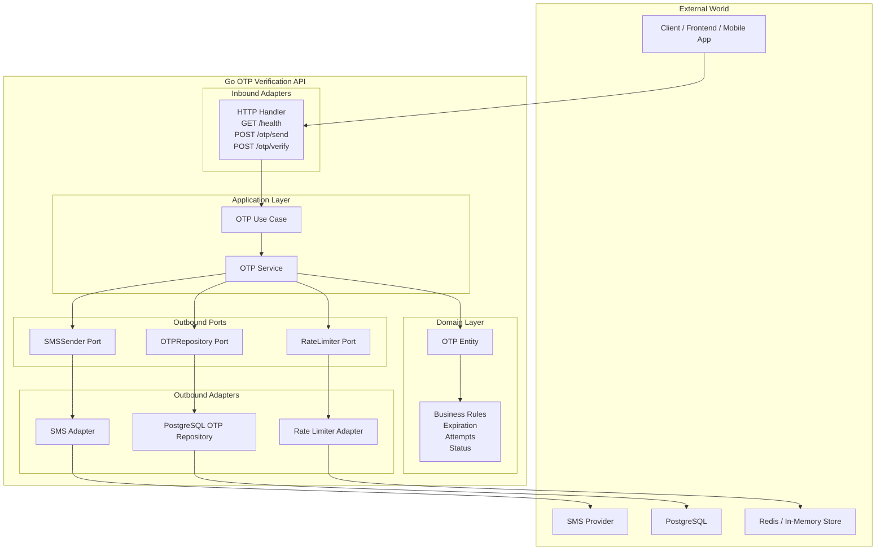

```mermaid
flowchart TB
    subgraph External["External World"]
        Client["Client / Frontend / Mobile App"]
        SMS["SMS Provider"]
        DB["PostgreSQL"]
        Cache["Redis / In-Memory Store"]
    end

    subgraph App["Go OTP Verification API"]
        subgraph InAdapters["Inbound Adapters"]
            HTTP["HTTP Handler<br/>GET /health<br/>POST /otp/send<br/>POST /otp/verify"]
        end

        subgraph Application["Application Layer"]
            UseCase["OTP Use Case"]
            Service["OTP Service"]
        end

        subgraph Domain["Domain Layer"]
            OTP["OTP Entity"]
            Rules["Business Rules<br/>Expiration<br/>Attempts<br/>Status"]
        end

        subgraph OutPorts["Outbound Ports"]
            OTPRepoPort["OTPRepository Port"]
            SmsPort["SMSSender Port"]
            RateLimiterPort["RateLimiter Port"]
        end

        subgraph OutAdapters["Outbound Adapters"]
            OTPRepoAdapter["PostgreSQL OTP Repository"]
            SmsAdapter["SMS Adapter"]
            RateLimiterAdapter["Rate Limiter Adapter"]
        end
    end

    Client --> HTTP
    HTTP --> UseCase
    UseCase --> Service
    Service --> OTP
    OTP --> Rules

    Service --> OTPRepoPort
    Service --> SmsPort
    Service --> RateLimiterPort

    OTPRepoPort --> OTPRepoAdapter
    SmsPort --> SmsAdapter
    RateLimiterPort --> RateLimiterAdapter

    OTPRepoAdapter --> DB
    SmsAdapter --> SMS
    RateLimiterAdapter --> Cache
```