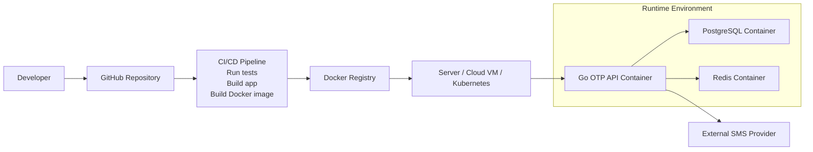

```mermaid
flowchart LR
    Dev["Developer"] --> GitHub["GitHub Repository"]

    GitHub --> CI["CI/CD Pipeline<br/>Run tests<br/>Build app<br/>Build Docker image"]

    CI --> Registry["Docker Registry"]

    Registry --> Server["Server / Cloud VM / Kubernetes"]

    subgraph Runtime["Runtime Environment"]
        API["Go OTP API Container"]
        DB["PostgreSQL Container"]
        Redis["Redis Container"]
    end

    Server --> API
    API --> DB
    API --> Redis
    API --> SMS["External SMS Provider"]
```