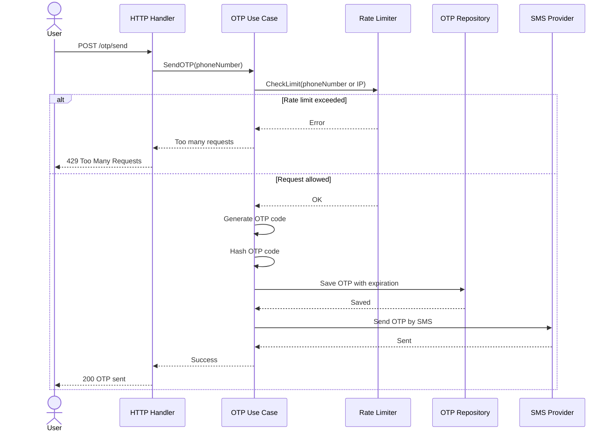

```mermaid

sequenceDiagram
    actor User
    participant Handler as HTTP Handler
    participant UseCase as OTP Use Case
    participant RateLimiter as Rate Limiter
    participant Repo as OTP Repository
    participant SMS as SMS Provider

    User->>Handler: POST /otp/send
    Handler->>UseCase: SendOTP(phoneNumber)

    UseCase->>RateLimiter: CheckLimit(phoneNumber or IP)

    alt Rate limit exceeded
        RateLimiter-->>UseCase: Error
        UseCase-->>Handler: Too many requests
        Handler-->>User: 429 Too Many Requests
    else Request allowed
        RateLimiter-->>UseCase: OK
        UseCase->>UseCase: Generate OTP code
        UseCase->>UseCase: Hash OTP code
        UseCase->>Repo: Save OTP with expiration
        Repo-->>UseCase: Saved
        UseCase->>SMS: Send OTP by SMS
        SMS-->>UseCase: Sent
        UseCase-->>Handler: Success
        Handler-->>User: 200 OTP sent
    end
```
