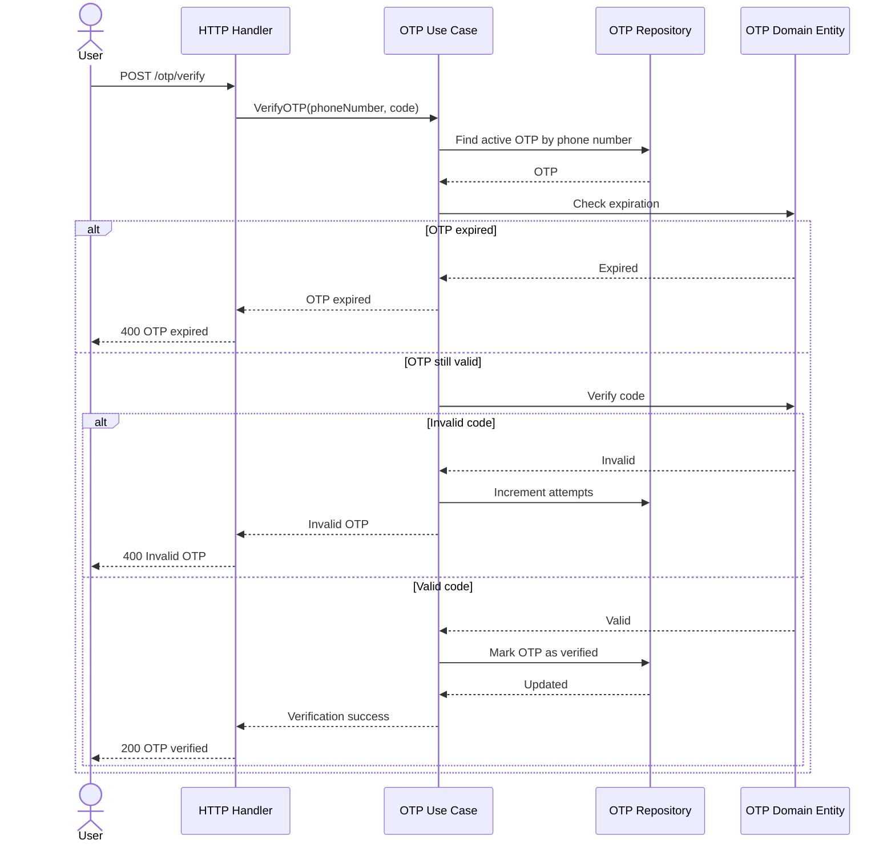

```mermaid

sequenceDiagram
    actor User
    participant Handler as HTTP Handler
    participant UseCase as OTP Use Case
    participant Repo as OTP Repository
    participant Domain as OTP Domain Entity

    User->>Handler: POST /otp/verify
    Handler->>UseCase: VerifyOTP(phoneNumber, code)

    UseCase->>Repo: Find active OTP by phone number
    Repo-->>UseCase: OTP

    UseCase->>Domain: Check expiration

    alt OTP expired
        Domain-->>UseCase: Expired
        UseCase-->>Handler: OTP expired
        Handler-->>User: 400 OTP expired
    else OTP still valid
        UseCase->>Domain: Verify code

        alt Invalid code
            Domain-->>UseCase: Invalid
            UseCase->>Repo: Increment attempts
            UseCase-->>Handler: Invalid OTP
            Handler-->>User: 400 Invalid OTP
        else Valid code
            Domain-->>UseCase: Valid
            UseCase->>Repo: Mark OTP as verified
            Repo-->>UseCase: Updated
            UseCase-->>Handler: Verification success
            Handler-->>User: 200 OTP verified
        end
    end
```
